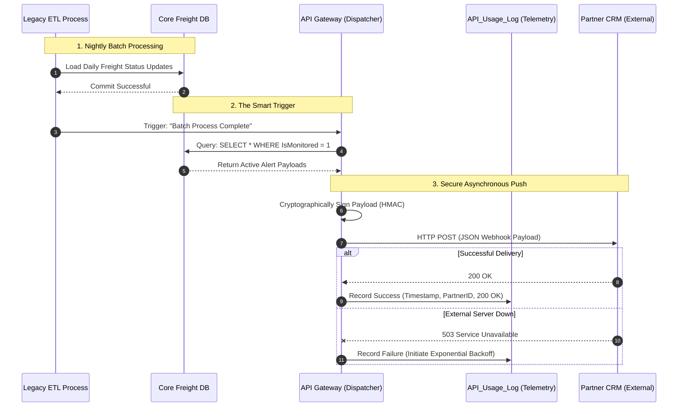

# Scenario 01: High-Throughput API Gateway for Real-Time Alerts

## 1. The Problem Statement

**Current State:** A B2B logistics company relies on a legacy SOAP XML backend for shipment tracking. Retail partners must manually query a centralized portal or run heavy, scheduled batch jobs to retrieve tracking updates. 

**Business Pain Point:** The "pull-based" architecture causes severe data desync. During peak seasons, delayed tracking updates lead to increased customer support tickets and missed SLAs. Forcing external partners to undertake massive IT overhauls carries a high risk of partner churn.

**Enterprise Constraints & Governance:**
* **Security & Data Sovereignty:** Must enforce B2B data segregation. Furthermore, regulatory constraints may periodically restrict core data from being processed in public multi-tenant clouds.
* **Cost:** The solution cannot rely on constant, high-frequency database polling, which would skyrocket compute costs.
* **Stakeholder Resistance:** The architecture must accommodate partners who refuse to build modern webhook listeners by maintaining standard REST API fallbacks.

## 2. Proposed Architecture & Constraint-Based Tech Stack

To solve the desync, we are migrating from a synchronous "Pull" model to an asynchronous "Push" model. Because enterprise environments face changing regulatory and budget constraints, the architecture supports a primary cloud-native stack and a compliant on-premises fallback.

### The Technology Decision Matrix
* **Primary Stack (Cloud-Native & Open Source):** * *Components:* Amazon API Gateway (or Kong Cloud), AWS Lambda for transformation, and Amazon SQS (Message Broker).
  * *Use Case:* Selected when public cloud is legally approved, optimizing for pay-as-you-go FinOps.
* **Fallback Stack (On-Premises / Enterprise COTS):**
  * *Components:* IBM webMethods (acts as a combined ESB, Message Queue, and API Gateway) OR self-hosted Kong Gateway + RabbitMQ.
  * *Use Case:* Triggered if the Chief Information Security Officer (CISO) bans open-source cloud components due to data sovereignty laws. The push-based logic remains identical, but execution shifts to internal data centers.

### Data Population: The Payload Transformation

**The Baseline (Legacy SOAP XML generated by the backend):**
```xml
<soapenv:Envelope xmlns:soapenv="[http://schemas.xmlsoap.org/soap/envelope/](http://schemas.xmlsoap.org/soap/envelope/)">
   <soapenv:Body>
      <FreightUpdate>
         <TrackingID>TRK-998822</TrackingID>
         <RetailPartnerCode>RTL-005</RetailPartnerCode>
         <CurrentStatus>DELAYED_CUSTOMS</CurrentStatus>
         <Timestamp>2026-04-24T08:30:00Z</Timestamp>
      </FreightUpdate>
   </soapenv:Body>
</soapenv:Envelope>
```

*[JSON Target Payload reserved for separate injection]*

## 3. Architecture Trade-Offs & Edge Case Resiliency

During the design phase, several architectural collisions and edge cases were identified and mitigated:

### A. The Data Layer Collision
* **Rejected Alternative (True CDC):** Implementing Change Data Capture (e.g., Debezium) directly on legacy database transaction logs was rejected. The infrastructure cost and unquantified availability risks to the fragile legacy system outweighed the ROI.
* **Selected Solution (Smart Batching):** We accept the legacy nightly ETL constraint. Instead of partners blindly polling the API, the system listens for an "ETL Batch Complete" flag, instantly firing a webhook to push the batched JSON alerts.

### B. The "Massive Payload" Edge Case
* **The Risk:** A market anomaly could result in a single daily batch containing 500,000 alerts. Pushing a 500MB JSON payload will crash the receiving partner's server.
* **The Mitigation (Claim Check Pattern):** If the payload exceeds 10MB, the Gateway automatically drops the payload and sends a lightweight notification containing a secure, temporary URL where the partner can download the batched zip file.

## 4. System Design & Sequence Flow

The sequence diagram illustrates the "Smart Batch" webhook trigger, incorporating the telemetry logging required for enterprise SLA defense.



## 5. Security, Telemetry & Operations

To transition this design into a production-ready enterprise solution, the following guardrails are established:

### A. Security & API Governance
* **HMAC Payload Signing:** To prevent DNS hijacking, the API Gateway signs the JSON payload using a cryptographic secret key (HMAC SHA-256). The partner validates this signature to ensure zero data tampering during transit.
* **Rate Limiting:** To prevent DDoS attacks or accidental partner code loops, strict rate limits (e.g., 100 requests/minute per partner) are enforced at the API Gateway.

### B. API Telemetry & SLA Auditing
Regardless of the commercial billing model, strict API metering is required for operational security.
* **The Usage Database:** The Gateway pushes all request/response metadata to an isolated `API_Usage_Log` SQL table. 
* **SLA Defense & FinOps:** Capturing the HTTP Status Codes provides non-repudiation. If a partner claims a missed alert, IT can cryptographically prove whether the payload was delivered (`200 OK`) or the partner's listener failed. This data also allows analysts to extract daily usage counts, providing management with accurate "Cost-to-Serve" reports.

### C. Fault Tolerance & Quality Assurance
* **The Dead Letter Queue (DLQ):** If a payload fails 3 consecutive retry attempts due to a partner outage, it is routed to a DLQ, and an automated alert is generated for the IT support team.
* **Test Automation:** Test cases (mapped to user stories in TFS/Azure DevOps) will validate XML-to-JSON parsing, HMAC signature validation, and load testing simulating 50,000 concurrent event triggers.

## 6. Execution Roadmap & Business Justification

### A. Executive Business Case
The current pull-based legacy system risks severe SLA financial penalties. By implementing an Event-Driven Gateway, we shift infrastructure costs from heavy database queries to a highly auditable push model. The SLA telemetry logging fundamentally protects corporate revenue and provides the foundation for future "Tiered Volume" API monetization.

### B. Minimum Viable Product (MVP) Scope
* **Target:** Deploy the Webhook Dispatcher for **one** Tier-1 pilot partner.
* **Scope:** Push daily freight status updates only. 
* **Exclusion:** Automated REST API fallbacks and self-service Developer Portals are deferred to Post-MVP releases.

### C. Agile Delivery Plan 
* **Sprint 1 (Foundation):** Provision the API Gateway, establish firewall configurations, and set up the `API_Usage_Log` database tables.
* **Sprint 2 (Core Logic):** Develop the Transformation Layer (mapping XML to JSON) and implement HMAC signing.
* **Sprint 3 (Integration & Pilot):** End-to-end testing with the pilot partner's CRM, refining the exponential backoff and DLQ logic.
