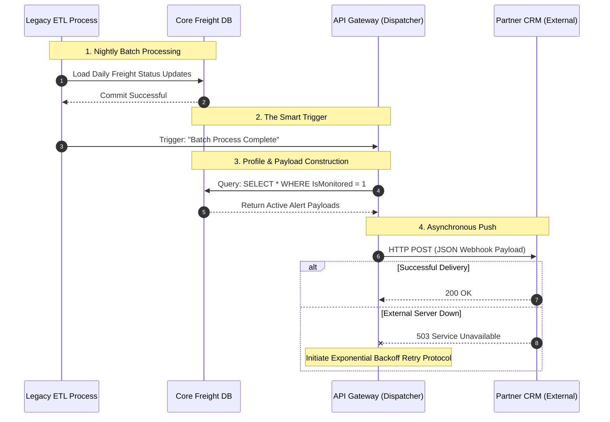

# Scenario 01: High-Throughput API Gateway for Real-Time Alerts

## 1. The Problem Statement

**Current State:** A B2B logistics company relies on a legacy SOAP XML backend for shipment tracking. Retail partners must manually query a centralized portal or run heavy, scheduled batch jobs to retrieve tracking updates. 

**Business Pain Point:** The "pull-based" architecture causes severe data desync. During peak seasons, delayed tracking updates lead to increased customer support tickets and missed SLAs. However, forcing all external retail partners to undertake massive IT overhauls to integrate with a new system carries a high risk of partner resistance and churn.

**Enterprise Constraints & Governance:**
* **Security:** Must enforce B2B data segregation (OAuth 2.0) so partners only receive their own freight data.
* **Cost:** The solution cannot rely on constant, high-frequency database polling, which would skyrocket cloud compute costs.
* **Stakeholder Resistance (The "Zero-IT-Effort" Factor):** The architecture must accommodate a multi-tiered adoption strategy. It must support partners who refuse to build modern webhook listeners (requiring a REST API fallback) and partners who refuse any IT development whatsoever (requiring the retention of legacy portal access or automated SFTP CSV drops).

**Target State:** Design a multi-modal API Gateway. The core architecture will transition to real-time, event-driven webhooks (pushing JSON payloads directly to partner CRMs). A secondary standard REST API and a legacy fallback must be maintained to balance modernization with business continuity.

## 2. Proposed Architecture & Tech Stack

To solve the desync and constraints, we are moving from a synchronous "Pull" model to an asynchronous "Push" model, backed by a multi-modal gateway.

### Core Components:
1. **Message Broker (Apache Kafka / Azure Service Bus):** Sits behind the legacy SOAP XML database. Instead of batching data, it detects "events" (e.g., a shipment status changing to 'Delayed') the moment a database row is updated, placing the event in a high-speed queue.
2. **Transformation Layer (Serverless Function):** An intermediary microservice that picks up the event from the broker, parses the heavy XML, and maps it to a lightweight JSON structure.
3. **API Gateway (Kong / AWS API Gateway):** The front door. It handles OAuth 2.0 authentication. It reads the partner's profile and routes the JSON payload via an HTTP POST request directly to the partner's registered Webhook URL.
4. **Fallback Interface:** The API Gateway also caches the latest status so that Tier 2 partners can perform standard REST API `GET` requests if they cannot support webhooks.

### Data Population: The Payload Transformation

**The Baseline (Legacy SOAP XML generated by the backend):**
```xml
<soapenv:Envelope xmlns:soapenv="http://schemas.xmlsoap.org/soap/envelope/">
   <soapenv:Body>
      <FreightUpdate>
         <TrackingID>TRK-998822</TrackingID>
         <RetailPartnerCode>RTL-005</RetailPartnerCode>
         <CurrentStatus>DELAYED_CUSTOMS</CurrentStatus>
         <Timestamp>2026-04-24T08:30:00Z</Timestamp>
      </FreightUpdate>
   </soapenv:Body>
</soapenv:Envelope>
```

The Target (Modern JSON Webhook pushed to the Partner CRM):

```json
{
  "event_type": "freight.status_updated",
  "tracking_id": "TRK-998822",
  "partner_id": "RTL-005",
  "data": {
    "status": "Delayed - Customs Hold",
    "updated_at": "2026-04-24T08:30:00Z",
    "action_required": true
  },
  "links": {
    "full_report": "https://api.logistics.com/v1/freight/TRK-998822"
  }
}
Note: The target JSON payload includes a HATEOAS link (full_report). This allows the partner system to immediately trigger a secondary API call if the delayed freight requires a full manifest download.
```


## 3. Architecture Decision & Trade-Off Analysis

During the design phase, we encountered a classic "Layer Collision": The Application Layer requires modern real-time push capabilities, but the legacy Data Layer is constrained to a heavy, nightly ETL batch process. We evaluated two paths:

### Option A: True Real-Time via Change Data Capture (CDC) - [Deferred to Phase 2]
* **The Architecture:** Attaching a CDC tool (e.g., Debezium) directly to the legacy database transaction logs to stream row-level updates to a message broker in milliseconds without querying the database.
* **The Decision:** Deferred. While technically superior, the infrastructure cost (Kafka/Event Hubs) and the massive paradigm shift required for the Data Engineering team outstrip the immediate ROI of freight tracking alerts. Furthermore, deploying log-miners on a fragile legacy backend carries high unquantified availability risks.

### Option B: Event-Driven "Smart Batching" - [Selected for Phase 1]
* **The Architecture:** We accept the Data Layer's constraint and retain the legacy nightly ETL job. However, instead of external partners blindly polling the API and guessing when the data is ready, the system listens for a single "ETL Batch Complete" flag. The API Gateway then instantly fires a webhook, pushing the batched JSON alerts to the partners.
* **The Trade-Offs:**
  * *Advantages:* Highly cost-effective, zero disruption to the data team's existing pipelines, eliminates wasted compute from empty REST API calls, and guarantees partners never miss an update.
  * *Weaknesses:* The business stakeholders must accept that while the *delivery* is instantaneous and automated, the underlying data is still 24 hours old.


## 4. System Design & Sequence Flow

The sequence diagram below illustrates the "Smart Batch" webhook trigger, ensuring data is only pushed once the legacy system has fully committed the daily updates, eliminating empty API polling.




## 5. Infrastructure, Governance & Operations

To transition this design into a production-ready enterprise solution, the following operational and architectural guardrails must be established:

### A. Infrastructure, Network & Protocols
* **Network Topology:** The API Gateway will reside in a public-facing DMZ (Demilitarized Zone) subnet, while the Transformation Layer and Message Broker remain in a strictly private Virtual Private Cloud (VPC) subnet. 
* **Protocols:** All B2B communication is strictly enforced over **HTTPS/TLS 1.3**. Legacy HTTP polling will be permanently blocked at the load balancer level.
* **Egress Gateway:** Webhooks firing outward to external partner CRMs will route through a dedicated NAT Gateway with static IP addresses so partners can whitelist our traffic.

### B. Security & API Governance
* **Authentication:** External partners will use OAuth 2.0 (Client Credentials flow) to retrieve temporary, scoped access tokens. 
* **Rate Limiting & WAF:** To prevent DDoS attacks or accidental partner loops, strict rate limits (e.g., 100 requests/minute per partner) are enforced at the API Gateway. A Web Application Firewall (WAF) will inspect payloads for SQL injection or cross-site scripting.

### C. Financials & Development Effort (FinOps)
* **Cloud Cost Optimization:** Shifting from constant DB polling to Event-Driven Smart Batching reduces database compute costs by an estimated 75%. The API Gateway cost is strictly tied to consumption (per million requests), ensuring high ROI.
* **Internal Effort:** Estimated at 3-4 development sprints to stand up the Webhook Dispatcher microservice, configure the API Gateway policies, and implement the Exponential Backoff Retry mechanism.

### D. External Onboarding & Documentation
* **Developer Portal:** We cannot assume partner IT teams will magically understand the integration. A self-service Developer Portal will be deployed hosting **OpenAPI (Swagger)** documentation.
* **Sandbox Environment:** Partners will be provided a sandbox testing environment where they can trigger dummy freight alerts to verify their Webhook listeners are parsing the JSON correctly before cutting over to production.

## 6. Execution Roadmap & Business Justification

To secure funding and transition from architecture to execution, the following delivery roadmap and business case govern the implementation:

### A. Executive Business Case (The Pitch)
**The ROI Equation:** The current pull-based legacy system risks severe SLA financial penalties and partner churn due to data desync. By implementing a Serverless API Gateway, we shift infrastructure costs from expensive, heavy database queries to a lightweight "pay-per-execution" cloud model. The operational savings and protected SLA revenue fundamentally offset the internal development cost within the first two quarters of deployment.

### B. Minimum Viable Product (MVP) Scope
To mitigate deployment risk, the MVP is strictly scoped:
* **Target:** Deploy the Webhook Dispatcher for **one** Tier-1 pilot partner.
* **Scope:** Push daily freight status updates only (excluding complex nested manifest documents). 
* **Exclusion:** Automated REST API fallbacks and self-service Developer Portals are deferred to Post-MVP releases.

### C. Agile Delivery Plan (Sprint Breakdown)
The MVP will be delivered across three two-week sprints:
* **Sprint 1 (Foundation):** Provision the cloud API Gateway, establish the private VPC link to the legacy database, and configure OAuth 2.0 security policies.
* **Sprint 2 (Core Logic):** Develop the Serverless Transformation Layer (mapping the legacy XML to the target JSON schema) and build the "ETL Complete" event listener.
* **Sprint 3 (Integration & Pilot):** End-to-end testing with the pilot partner's CRM. Monitor delivery success rates and refine the exponential backoff retry logic.

### D. Cost & Pricing Strategy (FinOps)
* **Development Cost (CAPEX):** 1 Scrum Team (Lead Dev, Cloud Engineer, QA) allocated for 3 Sprints.
* **Operational Cost (OPEX):** The Serverless infrastructure (e.g., AWS Lambda / API Gateway) is billed entirely on consumption. Because this is a "Smart Batch" system firing once daily per partner, the compute and egress costs are projected to be under $50/month at scale, providing a massive margin improvement over traditional dedicated hosting.
