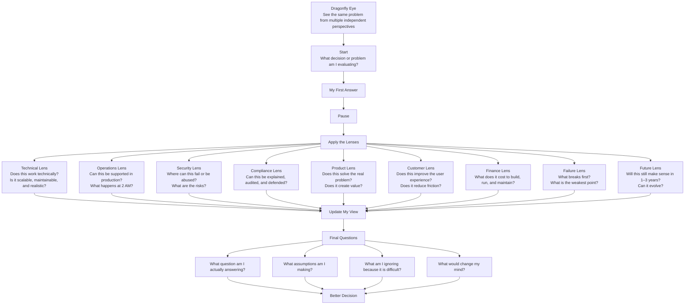

# Executive Reading Log: Superforecasting

**Book:** *Superforecasting*  
**Objective:** Think in probabilities and improve decision-making under uncertainty.

---

## Insight Log (Evolving)

### Illusion of Knowledge

- Humans are overconfident, but the deeper issue is:
  - we unknowingly replace hard questions with easier ones  
- The brain prefers quick answers (System 1), even when wrong  
- Certainty often comes from answering the wrong problem  

**Architecture Application:**
- Always ask: “What question am I actually answering?”  
- Challenge first solutions — they may solve a simplified problem  
- Avoid “clean designs” that ignore real constraints  

---

#### Deep Dive (Thinking Layer)

**Bait-and-Switch Thinking**

When I face a hard problem, my brain may silently replace it with an easier one.

Example:

Real question:
```text
Is this architecture scalable under real-world constraints and failure conditions?
```

Replaced question:
```text
Does this architecture look clean and well-designed?
```

---

**System 1 vs System 2**

- System 1:
  - fast, intuitive, confident  
  - based on experience  
  - can be very wrong  

- System 2:
  - slow, analytical  
  - requires effort  
  - more accurate  

> System 1 does not say “I don’t know” — it gives an answer anyway.

---

**Role of Doubt**

Doubt is not weakness — it is a thinking tool.

Good doubt:
- questions assumptions  
- challenges first answers  
- looks for failure points  

Bad doubt:
- overthinking  
- no decisions  

---

**Architecture Thinking Questions**

```text
What question am I actually answering?

Did I simplify the problem without realizing it?

What assumptions am I making?

What would break this design?

What am I ignoring because it is difficult?
```

---

### Prediction Spectrum

- Short-term predictions → more accurate  
- Long-term predictions → less accurate  
- Stable systems → predictable  
- Complex systems → uncertain  

---

### First Mental Shift

- Replace:
  - “This will work”  
- With:
  - “This has ~70% chance of working”  

---

### Keeping Score

- Vague statements are useless — if it cannot be measured, it is not a forecast  
- Probabilities are often misunderstood (e.g., 70% does not mean certainty)  
- Without tracking accuracy, improvement is impossible  
- Experts are not necessarily good forecasters  

**Architecture Application:**
- Express decisions with measurable outcomes  
- Avoid vague statements like “likely” or “should work”  
- Revisit decisions and evaluate accuracy  
- Separate expertise from prediction quality  

---

#### Deep Dive (Thinking Layer)

**Vagueness Problem**

Words like:
- “likely”
- “possible”
- “high chance”

are interpreted differently by different people.

> If a statement cannot be measured, it cannot be improved.

---

**Probability Misuse**

People assign percentages but behave as if outcomes are certain.

Example:

```text
“70% chance” → treated as “this will happen”
```

This leads to:
- overconfidence  
- poor decision evaluation  

---

**Brier Score (Core Concept)**

A scoring method used to measure forecast accuracy.

The deeper lesson:

> Without measuring prediction accuracy, there is no learning.

This introduces a new discipline:

```text
Make prediction → Track outcome → Compare → Improve
```

---

**Architecture Application**

I should start tracking decisions like this:

```text
Decision:
“This architecture will handle peak load.”

Prediction:
70% confidence

Outcome:
After testing / production

Result:
Was I correct?
What did I miss?
What should I adjust next time?
```

---

**Expert Problem**

Experts may have deep knowledge, but still produce poor predictions.

> Knowledge does not automatically equal forecasting accuracy.

This means I should respect expertise, but still ask:
- Was the prediction measurable?
- Was the confidence level clear?
- Was the outcome tracked?

---

**Dragonfly Eye**

> Seeing the same problem from multiple independent perspectives.

This is not just collecting opinions.

It is:
- breaking a problem into different viewpoints  
- combining multiple mental models  
- avoiding single-perspective bias  

---

**Architecture Thinking Application**

Instead of asking:

```text
Is this a good architecture?
```

Ask:

```text
How would:
- an operations engineer see this?
- a compliance officer see this?
- a customer experience lead see this?
- a security architect see this?
- a product owner see this?
- a failure scenario expose weaknesses?
```
---
**Lenses to use as an example**
```
From the customer lens:
Does this improve the user experience?

From the operations lens:
Can this be supported at 2 AM?

From the security lens:
Where could this be abused?

From the compliance lens:
Can this decision be explained and audited?

From the product lens:
Does this create measurable value?

From the finance lens:
What does this cost to run and maintain?

From the failure lens:
What breaks first?
```
---
---
**Career Lenses**
```
Current self:
Does this opportunity excite me?

Future self:
Will this compound over 3 years?

Family lens:
Does this affect stability or time?

Financial lens:
Does this improve or weaken my position?

Learning lens:
Will I grow from this?

Risk lens:
What could go wrong?
```
---
---
**Daily Practice for Dragonfly Eye**
```
1. Write your first answer
2. Ask: “What lens am I missing?”
3. Add 3 more perspectives
4. Look for contradictions
5. Update your decision
```
---
---

**Personal Reflection**

I realized:

- I rarely measure if my decisions were correct  
- I sometimes use vague language when uncertain  
- I may rely too much on a single perspective when designing  
- I need to practice disciplined doubt without falling into overthinking  

---

**How I Will Apply This**

- Assign probability to important decisions  
- Track outcomes after testing or implementation  
- Avoid vague wording in architecture discussions  
- Use Dragonfly Eye to evaluate designs from multiple perspectives  
- Revisit assumptions instead of defending old decisions  

---

> Good thinking is not about being right once,  
> but about improving accuracy over time.

---

## Running Application Notes

- Start assigning probability to architecture decisions  
- Assign probability AND revisit accuracy later  
- Track uncertainty explicitly  
- Check for “bait-and-switch” thinking in every design  
- Use Dragonfly Eye before finalizing important decisions  
- Replace vague wording with measurable claims  

---
---


---
