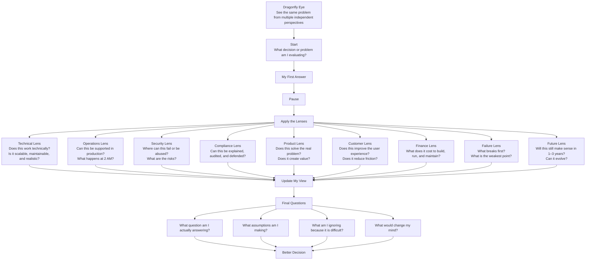

# Executive Reading Log: Superforecasting

**Book:** *Superforecasting*  
**Objective:** Think in probabilities and improve decision-making under uncertainty.

---

## Insight Log (Evolving)

### Illusion of Knowledge

- Humans are overconfident, but the deeper issue is:
  - we unknowingly replace hard questions with easier ones  
- The brain prefers quick answers (System 1), even when wrong  
- Certainty often comes from answering the wrong problem  

**Architecture Application:**
- Always ask: “What question am I actually answering?”  
- Challenge first solutions — they may solve a simplified problem  
- Avoid “clean designs” that ignore real constraints  

---

#### Deep Dive (Thinking Layer)

**Bait-and-Switch Thinking**

When I face a hard problem, my brain may silently replace it with an easier one.

Example:

Real question:

```text
Is this architecture scalable under real-world constraints and failure conditions?
```

Replaced question:

```text
Does this architecture look clean and well-designed?
```

---

**System 1 vs System 2**

- System 1:
  - fast, intuitive, confident  
  - based on experience  
  - can be very wrong  

- System 2:
  - slow, analytical  
  - requires effort  
  - more accurate  

> System 1 does not say “I don’t know” — it gives an answer anyway.

---

**Role of Doubt**

Doubt is not weakness — it is a thinking tool.

Good doubt:
- questions assumptions  
- challenges first answers  
- looks for failure points  

Bad doubt:
- overthinking  
- no decisions  

---

**Architecture Thinking Questions**

```text
What question am I actually answering?

Did I simplify the problem without realizing it?

What assumptions am I making?

What would break this design?

What am I ignoring because it is difficult?
```

---

### Prediction Spectrum

- Short-term predictions → more accurate  
- Long-term predictions → less accurate  
- Stable systems → predictable  
- Complex systems → uncertain  

---

### First Mental Shift

- Replace:
  - “This will work”  
- With:
  - “This has ~70% chance of working”  

---

### Keeping Score

- Vague statements are useless — if it cannot be measured, it is not a forecast  
- Probabilities are often misunderstood (e.g., 70% does not mean certainty)  
- Without tracking accuracy, improvement is impossible  
- Experts are not necessarily good forecasters  

**Architecture Application:**
- Express decisions with measurable outcomes  
- Avoid vague statements like “likely” or “should work”  
- Revisit decisions and evaluate accuracy  
- Separate expertise from prediction quality  

---

#### Deep Dive (Thinking Layer)

**Vagueness Problem**

Words like:
- “likely”
- “possible”
- “high chance”

are interpreted differently by different people.

> If a statement cannot be measured, it cannot be improved.

---

**Probability Misuse**

People assign percentages but behave as if outcomes are certain.

Example:

```text
“70% chance” → treated as “this will happen”
```

This leads to:
- overconfidence  
- poor decision evaluation  

---

**Brier Score (Core Concept)**

A scoring method used to measure forecast accuracy.

The deeper lesson:

> Without measuring prediction accuracy, there is no learning.

This introduces a new discipline:

```text
Make prediction → Track outcome → Compare → Improve
```

---

**Architecture Application**

I should start tracking decisions like this:

```text
Decision:
“This architecture will handle peak load.”

Prediction:
70% confidence

Outcome:
After testing / production

Result:
Was I correct?
What did I miss?
What should I adjust next time?
```

---

**Expert Problem**

Experts may have deep knowledge, but still produce poor predictions.

> Knowledge does not automatically equal forecasting accuracy.

This means I should respect expertise, but still ask:
- Was the prediction measurable?
- Was the confidence level clear?
- Was the outcome tracked?

---

**Dragonfly Eye**

> Seeing the same problem from multiple independent perspectives.

This is not just collecting opinions.

It is:
- breaking a problem into different viewpoints  
- combining multiple mental models  
- avoiding single-perspective bias  

---

**Architecture Thinking Application**

Instead of asking:

```text
Is this a good architecture?
```

Ask:

```text
How would:
- an operations engineer see this?
- a compliance officer see this?
- a customer experience lead see this?
- a security architect see this?
- a product owner see this?
- a failure scenario expose weaknesses?
```

---

**Lenses to Use as an Example**

```text
From the customer lens:
Does this improve the user experience?

From the operations lens:
Can this be supported at 2 AM?

From the security lens:
Where could this be abused?

From the compliance lens:
Can this decision be explained and audited?

From the product lens:
Does this create measurable value?

From the finance lens:
What does this cost to run and maintain?

From the failure lens:
What breaks first?
```

---

**Career Lenses**

```text
Current self:
Does this opportunity excite me?

Future self:
Will this compound over 3 years?

Family lens:
Does this affect stability or time?

Financial lens:
Does this improve or weaken my position?

Learning lens:
Will I grow from this?

Risk lens:
What could go wrong?
```

---

**Daily Practice for Dragonfly Eye**

```text
1. Write your first answer
2. Ask: “What lens am I missing?”
3. Add 3 more perspectives
4. Look for contradictions
5. Update your decision
```

---

### Superforecasters

- Forecasting skill can be real and measurable  
- Ordinary people can outperform experts when accuracy is tracked  
- Credentials and seniority do not automatically equal better judgment  
- Regression to the mean helps separate luck from repeated skill  

**Architecture Application:**
- Do not accept decisions only because they come from senior people, vendors, or experts  
- Evaluate decisions based on reasoning, assumptions, evidence, and outcomes  
- Track whether predictions were accurate over time  
- Look for people who update their thinking, not only people who sound confident  

---

#### Deep Dive (Thinking Layer)

**Main Insight**

> Do not ask only: “Who said it?”  
> Ask: “How would we know if this is true?”

This is one of the most important lessons for architecture work.

In meetings, people often overvalue:
- title  
- seniority  
- confidence  
- vendor reputation  
- expert language  

But forecasting teaches that judgment should be tested.

---

**Expertise vs Forecasting Accuracy**

Expertise matters, but it does not automatically create accurate forecasts.

An expert may:
- understand the domain deeply  
- have strong credentials  
- speak confidently  

But still be wrong if they:
- do not update beliefs  
- ignore feedback  
- rely on fixed assumptions  
- avoid measurable predictions  

---

**Regression to the Mean**

A single correct prediction may be luck.

Repeated accuracy over time is more meaningful.

This means I should avoid overreacting to one success or one failure.

Better question:

```text
Has this person, team, or method been accurate repeatedly?
```

---

**Architecture Thinking Application**

In architecture reviews, I should ask:

```text
Is this recommendation supported by evidence or authority?

What assumptions are behind this decision?

How would we validate whether this is true?

What result would prove this decision wrong?

Has this team or vendor been accurate in similar situations before?

Are we confusing confidence with competence?
```

---

**Personal Reflection**

I realized I may sometimes give too much weight to:
- senior opinions  
- vendor recommendations  
- confident explanations  
- expert-sounding language  

The better approach is:

```text
Respect expertise
Question assumptions
Track outcomes
Update beliefs
```

---

> Good judgment is not proven by confidence.  
> It is proven by repeated accuracy over time.

---

### Supersmart?

- Superforecasters are not successful only because they are “smarter”  
- Intelligence helps, but structured thinking matters more  
- Big problems become manageable when broken into smaller estimable parts  
- The outside view helps prevent overconfidence in my own situation  

**Architecture Application:**
- Do not rely only on intelligence, confidence, or experience  
- Break architecture questions into smaller measurable drivers  
- Use outside view before trusting my inside view  
- Apply Dragonfly Eye before finalizing decisions  

---

#### Deep Dive (Thinking Layer)

**Main Insight**

> Good forecasting is not about being the smartest person in the room.  
> It is about breaking problems down, checking assumptions, and updating beliefs.

This matters in architecture because complex systems can make people sound confident even when decisions are built on weak assumptions.

The goal is not to sound smart.

The goal is to make the problem clearer.

---

## Fermi-izing

**Fermi-izing** means breaking a big unknown question into smaller questions that can be estimated.

Instead of asking:

```text
Will this architecture succeed?
```

Break it into smaller questions:

```text
What does success mean?

How many users or transactions are expected?

What is the current baseline?

What part of the process is slow today?

What percentage can be automated?

What percentage will still need manual review?

What failure rate is acceptable?

What is the cost of failure?

What is the expected peak load?

What dependency is most likely to fail?
```

The goal is not perfect accuracy.

The goal is to move from:

```text
vague judgment
```

to:

```text
structured estimation
```

---

### Fermi-izing Questions for My Architecture Work

When designing a scenario, I should ask:

```text
What is the actual decision I am trying to make?

What outcome am I trying to improve?

What is the current baseline?

What are the key variables that drive the outcome?

Which variables do I know?

Which variables am I guessing?

Which assumption has the biggest impact if wrong?

Can I estimate this with a range instead of a single number?

What data would reduce uncertainty?

What should I test first?
```

---

### Example: KYC Modernization

Bad question:

```text
Will KYC modernization work?
```

Better Fermi-style breakdown:

```text
What percentage of applications are low-risk?

What percentage of documents can IDP extract correctly?

What percentage will need manual review?

How long does manual review take today?

What is the target onboarding time?

What is the acceptable false rejection rate?

How often do legacy systems fail?

How many applications arrive during peak periods?

What cost is saved per automated application?
```

Now the architecture decision becomes easier to reason about.

---

### Example: API Integration Scenario

Bad question:

```text
Will partners adopt the new webhook model?
```

Better Fermi-style breakdown:

```text
How many partners currently use polling?

How many partners have technical teams capable of webhook integration?

How many partners suffer from delayed tracking updates?

How many partners need REST fallback?

How much support effort is required per partner?

What incentive would increase adoption?

What percentage adoption is realistic in 3 months?

What percentage adoption is realistic in 12 months?
```

---

### Example: RPA Bridge Scenario

Bad question:

```text
Will the RPA API bridge scale?
```

Better Fermi-style breakdown:

```text
How many requests arrive daily?

How long does one bot execution take?

How many concurrent bots are available?

What percentage of requests fail automation?

How many failures require Human-in-the-Loop?

How many manual cases can operations handle per day?

What is the cost per bot license?

At what volume does RPA become too expensive?
```

---

## Inside View vs Outside View

**Inside View:**  
Looking at the situation from my own context, plan, team, and assumptions.

**Outside View:**  
Looking at similar situations and asking what usually happens.

Both are useful, but the outside view protects me from overconfidence.

---

### Inside View Questions

These questions focus on my specific scenario:

```text
What do I think will happen in this project?

Why do I believe this design will work?

What do I know about this organization, team, or system?

What special constraints exist here?

What makes this case different?

What dependencies do I control?

What dependencies do I not control?
```

---

### Outside View Questions

These questions compare my scenario to similar situations:

```text
How do similar projects usually go?

How long do similar integrations usually take?

How often do similar systems fail in production?

What usually causes delay in this type of project?

What usually gets underestimated?

What do postmortems from similar systems show?

What is the base rate for success or delay?

What would a neutral architect expect?
```

---

### My Rule

Use the **outside view first**, then adjust with the inside view.

```text
Outside View → Base Rate
Inside View  → Local Adjustment
Final View   → Updated Forecast
```

Example:

```text
Outside View:
Similar regulated integrations usually take 6–9 months.

Inside View:
This team already has API Gateway experience.

Updated Forecast:
Delivery may be closer to 5–7 months, not 3 months.
```

---

## Dragonfly Eye Connection

This chapter strengthens the Dragonfly Eye idea.

Fermi-izing breaks the problem into parts.  
Outside view compares the problem to reality.  
Dragonfly Eye looks at the problem from multiple perspectives.

Together:

```text
Fermi-izing   → break the problem down
Outside View  → compare with similar cases
Dragonfly Eye → inspect from multiple lenses
```

---

## Architecture Thinking Application

Before finalizing a design, I should ask:

```text
What is the big question?

Can I break it into smaller measurable questions?

What is the outside view?

What is my inside view?

What perspective am I missing?

What would make my first answer wrong?

What data would change my confidence?
```

---

## Personal Reflection

I realized that I should not try to “sound smart” when solving architecture problems.

The better goal is to:

```text
think clearly
break problems down
question assumptions
use multiple perspectives
track outcomes
```

This chapter also reminds me not to overvalue confidence.

A person can sound intelligent and still be wrong.

A better question is:

```text
How would we know if this is true?
```

---

> Intelligence helps, but structured thinking compounds.

---

### Superquants?

- People often demand yes/no answers, but reality usually requires probabilities  
- The mind defaults to three rough settings: yes, no, maybe  
- Better judgment requires finer probability ranges  
- “How” questions are often more useful than “why” questions  

**Architecture Application:**
- Do not force uncertain architecture decisions into yes/no answers  
- Replace vague confidence with probability ranges  
- Ask how a system succeeds or fails, not only why it should work  
- Use probability to make assumptions visible and testable  

---

#### Deep Dive (Thinking Layer)

**Main Insight**

> Do not force uncertainty into yes/no answers.  
> Use probability to make judgment visible, measurable, and easier to improve.

In work, people often ask:

```text
Will this work?
Will the vendor deliver?
Is this architecture scalable?
Will users adopt this?
```

But these questions usually should not be answered with only yes or no.

A better answer is:

```text
There is a 70% chance this works under these assumptions.
```

That answer is less comfortable, but more honest.

---

## The Three-Setting Mental Dial

The brain often thinks in only three settings:

```text
Yes
No
Maybe
```

This is too rough.

Many different situations get hidden inside “maybe.”

Example:

```text
51% chance → maybe
80% chance → maybe
30% chance → maybe
```

But these are not the same.

A better mental dial is:

```text
10% → 20% → 30% → 40% → 50% → 60% → 70% → 80% → 90%
```

---

## Probability Range Guide

This is a practical scale I can use in work and life.

| Probability | Meaning | How I Should Treat It |
|------------|---------|------------------------|
| 10% | Very unlikely | Do not ignore, but do not plan around it as the main path |
| 20% | Unlikely | Track as a risk or edge case |
| 30% | Possible but weak | Consider mitigation if impact is high |
| 40% | Plausible | Needs attention and evidence |
| 50% | Uncertain / toss-up | Avoid strong commitments |
| 60% | Slightly likely | Move carefully; validate assumptions |
| 70% | Likely | Plan around it, but keep fallback |
| 80% | Very likely | Strong planning assumption |
| 90% | Highly likely | Treat as near-certain, but still not guaranteed |

> Important: Percentages should clarify judgment, not create fake precision.

---

## Words vs Percentages

Vague words can hide different meanings.

| Word | Possible Meaning |
|------|------------------|
| Maybe | 30% to 70% |
| Likely | 60% to 80% |
| Very likely | 80% to 90% |
| Possible | 20% to 60% |
| Unlikely | 10% to 40% |

This is why percentages matter.

They reduce misunderstanding.

---

## Practical Forecasting Tool

Use this structure when making important decisions:

```text
Claim:
What do I think will happen?

Probability:
How confident am I?

Assumptions:
What must be true?

Failure condition:
What would prove me wrong?

Update trigger:
What evidence would change my confidence?
```

---

### Example: Architecture Decision

```text
Claim:
The webhook model will reduce partner polling load within 6 months.

Probability:
70%

Assumptions:
Tier-1 partners are willing to integrate.
Developer documentation is clear.
Fallback REST support remains available.
Internal support can handle onboarding.

Failure condition:
Less than 30% partner adoption after pilot.

Update trigger:
Partner feedback during onboarding.
Support ticket volume.
API usage telemetry.
```

---

### Example: Career Decision

```text
Claim:
This role will improve my path toward Solution Architecture.

Probability:
65%

Assumptions:
The role exposes me to complex systems.
I will work with senior architects.
I will get ownership of design decisions.
The environment supports learning.

Failure condition:
The role is mostly operational with no design exposure.

Update trigger:
Interview signals.
Job description details.
Manager expectations.
First 90-day responsibilities.
```

---

## How vs Why

“Why” can lead to stories, blame, or explanations after the fact.

“How” forces mechanism.

Instead of asking:

```text
Why will this architecture succeed?
```

Ask:

```text
How exactly will this architecture succeed?

What steps must happen?

Which dependency must hold?

Where could the chain break?

What would make success more or less likely?
```

Instead of asking:

```text
Why did this project fail?
```

Ask:

```text
How did it fail?

What sequence of events led to failure?

Which assumption broke first?

What signal was ignored?

What could have changed the outcome?
```

---

## Training Myself to Think in Probabilities

I can train this skill through small daily practice.

### Daily Practice

```text
1. Make one small forecast every day
2. Assign a probability
3. Write the assumption
4. Check later if it happened
5. Adjust how I think
```

Example:

```text
Forecast:
I will finish this chapter tonight.

Probability:
80%

Assumption:
No urgent work interruption.

Outcome:
Check tomorrow.
```

---

### Weekly Practice

```text
1. Review 3 forecasts
2. Ask what I got right
3. Ask what I missed
4. Adjust my probability scale
5. Notice if I was overconfident or underconfident
```

---

### Architecture Practice

Before finalizing a design, write:

```text
Claim:
Probability:
Assumptions:
Failure condition:
Update trigger:
```

This turns architecture from:

```text
I think this is good.
```

into:

```text
I can explain what I believe, how confident I am, and what would change my mind.
```

---

## Personal Reflection

I realized I often use vague confidence words because they feel safer.

But vague words make it harder to learn.

If I say:

```text
This will likely work.
```

I can avoid being wrong.

But if I say:

```text
I am 70% confident this will work.
```

Then I can learn later whether my confidence was calibrated.

This is uncomfortable, but it is how improvement happens.

---

> Probability is not about pretending to know the future.  
> It is about making uncertainty clear enough to improve judgment.

---

## Running Application Notes

- Start assigning probability to architecture decisions  
- Assign probability AND revisit accuracy later  
- Track uncertainty explicitly  
- Check for “bait-and-switch” thinking in every design  
- Use Dragonfly Eye before finalizing important decisions  
- Replace vague wording with measurable claims  
- Respect expertise, but validate claims  
- Ask: “How would we know if this is true?”  
- Avoid confusing confidence with competence  
- Use Fermi-izing to break large architecture questions into smaller estimable parts  
- Use outside view before trusting my inside view  
- Ask: “What is the base rate for this type of project?”  
- Avoid confusing intelligence with good judgment  
- Avoid yes/no answers when probability is more honest  
- Use probability ranges to clarify uncertainty  
- Ask “how would this work/fail?” instead of only “why?”  
- Use the practical forecasting tool for major decisions  

---

## Dragonfly Eye Map



---

## To Be Used in Future Scenarios

- Use Fermi-izing to break large architecture questions into smaller estimable parts  
- Use outside view before trusting my inside view  
- Ask: “What is the base rate for this type of project?”  
- Ask: “How would we know if this is true?”  
- Avoid confusing intelligence with good judgment  
