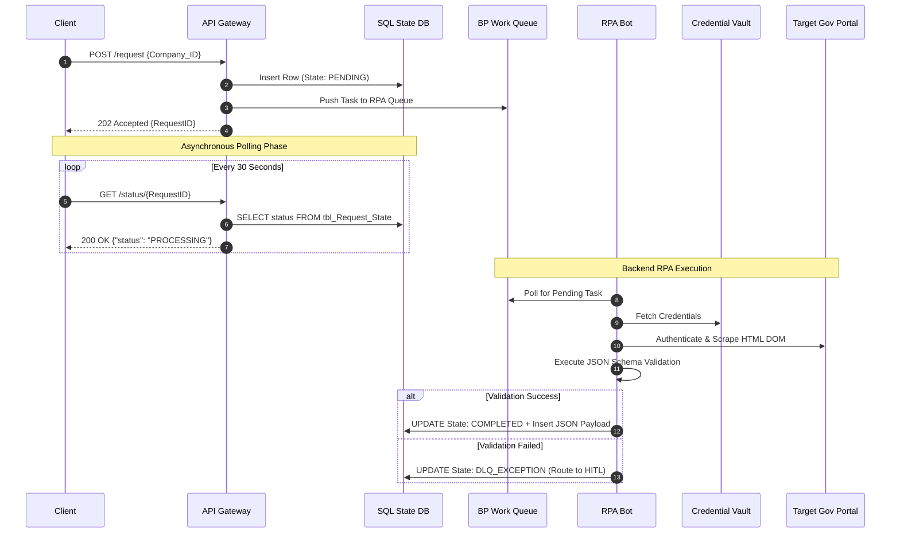

# Technical Blueprint: Asynchronous RPA API Bridge

## 1. Architectural Patterns

This solution utilizes three core enterprise architecture patterns to ensure system resilience and performance:

1. **Asynchronous Request-Reply (Polling):** Bridges the fast API Gateway with the slow backend UI automation process.
2. **State Management:** Decouples the API from the RPA infrastructure. APIs read strictly from an SQL state table, preventing read-heavy polling from crashing the bot servers.
3. **Idempotency:** Caches the initial request to ensure that duplicate client calls do not trigger duplicate RPA bots.

---

## 2. Sequence Diagram



---

## 3. Data Quality & Validation Engine

To prevent **"Garbage In, Garbage Out,"** the RPA bot implements an internal JSON Schema Validator before any database update occurs.

- **Rule Enforcement:** Ensures extracted HTML fields, such as `registration_number`, meet strict length/type requirements.
- **Failure State:** If the Gov portal changes its layout and the bot scrapes corrupted text, the schema validation fails. The bot safely aborts the database transaction using `ROLLBACK`, flags the item as an exception, and routes it to the Human-in-the-Loop (HITL) DLQ.

---

## 4. API Contract Specifications

### Service A: The Initiator (`POST /api/v1/registry/request`)

- **Success Response:** `202 Accepted`
- **Payload:** Returns a unique `RequestID` and instructions to poll Service B.

---

### Service B: The Poller (`GET /api/v1/registry/status/{RequestID}`)

Returns the state and the lightweight JSON payload directly from `tbl_Request_State`.

#### State 1: Running

**HTTP Status:** `200 OK`

```json
{
  "status": "PROCESSING"
}
```

#### State 2: HITL Fallback

**HTTP Status:** `200 OK`

```json
{
  "status": "MANUAL_REVIEW",
  "message": "Routed to operations.",
  "estimated_completion": "24_HOURS"
}
```

#### State 3: Completed

**HTTP Status:** `200 OK`

```json
{
  "request_id": "REQ-998877",
  "status": "COMPLETED",
  "timestamp": "2026-04-25T19:13:15Z",
  "data": {
    "company_name": "Tech Solutions LLC",
    "registration_number": "1010123456",
    "status": "ACTIVE",
    "issue_date": "2015-08-12",
    "capital_amount": 500000
  }
}
```

---

### Service C: The Audit Trail (`GET /api/v1/registry/history?company_id={ID}`)

Returns historical API calls utilizing pagination, with a limit of 50 records per page.

---

## 5. Resilience & Error Handling

- **API Rate Limiting:** Enforces client-specific quotas using HTTP `429` to prevent shared pool exhaustion.
- **Exponential Backoff:** If the bot cannot connect to the SQL DB to mark completion, it uses an exponential backoff loop of `5s`, `15s`, and `30s` to retry the transaction safely.
- **Database Failsafes / Orphan Sweeps:** An automated SQL Agent Job runs every 10 minutes to locate any `RequestID` stuck in the `PROCESSING` state for over 2 hours, automatically moving them to `FAILED` to prevent infinite client polling loops.

---

### HTTP 429 Payload: Rate Limit Exceeded

```http
HTTP/1.1 429 Too Many Requests
Retry-After: 3600
Content-Type: application/json

{
  "error_code": "RATE_LIMIT_EXCEEDED",
  "message": "Quota exceeded. Please wait 3600 seconds."
}
```
