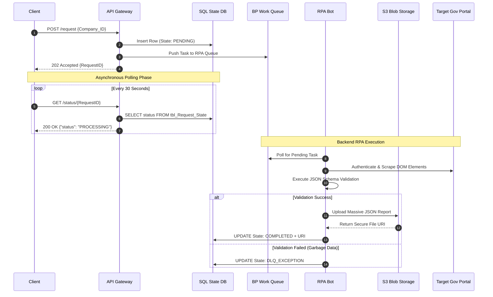

# Technical Blueprint: Asynchronous RPA API Bridge

## 1. Architectural Patterns
This solution utilizes three core enterprise architecture patterns to ensure system resilience and performance:
1. **Asynchronous Polling:** Bridges the fast API Gateway with the slow backend UI automation process.
2. **State Management:** Decouples the API from the RPA infrastructure. APIs read strictly from an SQL state table, preventing read-heavy polling from crashing the bot servers.
3. **Claim Check Pattern (Payload Offloading):** Massive scraped reports are stored in Cloud Blob Storage, returning only a lightweight reference URL to the client to prevent database bloat and API memory exhaustion.

## 2. Sequence Diagram



## 3. Data Quality & Validation Engine
To prevent "Garbage In, Garbage Out," the RPA bot implements an internal JSON Schema Validator before any database update occurs.
* **Rule Enforcement:** Ensures fields like `registration_number` meet strict length/type requirements.
* **Failure State:** If the Gov portal changes its layout and the bot scrapes corrupted data, the schema validation fails. The bot safely aborts the database transaction (`ROLLBACK`), flags the item as an exception, and routes it to the Human-in-the-Loop (HITL) DLQ.

## 4. API Contract Specifications

### Service A: The Initiator (`POST /api/v1/registry/request`)
* **Success Response:** `202 Accepted`
* **Payload:** Returns a unique `RequestID` and instructions to poll Service B.

### Service B: The Poller (`GET /api/v1/registry/status/{RequestID}`)
Returns the state from `tbl_Request_State`. If completed, utilizes the Claim Check pattern to deliver large payloads.
* **State 1 (Running):** `200 OK` | `{"status": "PROCESSING"}`
* **State 2 (Completed):** ```json
{
  "request_id": "REQ-998877",
  "status": "COMPLETED",
  "timestamp": "2026-04-25T19:13:15Z",
  "data_download_url": "[https://storage.enterprise.com/reports/REQ-998877.json?token=secure123](https://storage.enterprise.com/reports/REQ-998877.json?token=secure123)",
  "expires_in": "3600_SECONDS"
}
```

### Service C: The Audit Trail (`GET /api/v1/registry/history?company_id={ID}`)
Returns historical API calls utilizing pagination (limit 50 per page).

## 5. Resilience & Error Handling
* **API Rate Limiting:** Enforces client-specific quotas (HTTP 429).
* **Database Failsafes:** An automated SQL Agent Job ("Orphan Sweep") runs every 10 minutes to locate any `RequestID` stuck in the `PROCESSING` state for over 2 hours, automatically moving them to `FAILED` to prevent infinite client polling loops.
* **Exponential Backoff:** If the bot cannot connect to the SQL DB to mark completion, it utilizes an exponential backoff loop (5s, 15s, 30s) to retry the transaction safely.
