# Technical Blueprint: Asynchronous RPA API Bridge

## 1. Architectural Pattern & Diagram
This solution utilizes the **Asynchronous Request-Reply (Polling) Pattern** combined with **Idempotency** to bridge a fast API Gateway (30-second timeout) with a slow backend UI automation process (~3-minute execution).

```mermaid
sequenceDiagram
    autonumber
    participant Client
    participant Gateway as API Gateway
    participant DB as SQL Telemetry DB
    participant Queue as BP Work Queue
    participant Bot as RPA Bot (Blue Prism)
    participant Vault as Credential Vault
    participant Gov as Target Gov Portal

    Client->>Gateway: POST /request {Company_ID}
    Gateway->>Gateway: Validate API Key & Rate Limits
    
    alt Quota Exceeded
        Gateway-->>Client: 429 Too Many Requests
    else Quota Valid
        Gateway->>DB: Log Transaction Start (Billing)
        Gateway->>Queue: Push Task to Native RPA Queue
        Gateway-->>Client: 202 Accepted {RequestID}
    end

    Note over Client, Gateway: Asynchronous Polling Phase
    loop Every 30 Seconds
        Client->>Gateway: GET /status/{RequestID}
        Gateway->>Queue: Check Task State
        alt Task Pending/Running
            Gateway-->>Client: 200 OK {"status": "PROCESSING"}
        else Task Complete
            Gateway-->>Client: 200 OK {"status": "COMPLETED", "data": {...}}
        end
    end

    Note over Queue, Gov: Backend RPA Execution
    Bot->>Queue: Poll for Pending Task
    Queue-->>Bot: Assign {Company_ID}
    Bot->>Vault: Fetch Gov Portal Credentials dynamically
    Vault-->>Bot: Secure Credential Token
    Bot->>Gov: Authenticate & Scrape DOM Elements
    
    alt Scrape Success
        Bot->>Queue: Update Status to "Completed" + JSON Payload
        Bot->>DB: Log Success for Monthly Billing
    else Scrape Failure (Captcha/Timeout)
        Bot->>Queue: Flag as Exception (Route to DLQ / HITL)
    end
```



## 2. Component Design & Traffic Flow
* **API Gateway (Service A, B, C):** Validates the client, enforces Rate Limits, prevents duplicate requests (Idempotency), and pushes the `Company_ID` directly into the Blue Prism REST API Work Queue. 
* **Blue Prism (Digital Workers):** A shared pool of 5 Windows VMs constantly polls the Work Queue, accesses the target web portal, scrapes the HTML data, formats it to JSON, and updates the queue status.
* **Telemetry DB (SQL Server):** Records every transaction payload, timestamp, and HTTP status code to the `Usage_DumpUsage` table for monthly client billing and Power BI dashboard analytics.
* **Credential Vault (CyberArk/Key Vault):** Stores the target portal's credentials. The bot requests the password at runtime in memory, ensuring zero hardcoded credentials exist in the automation scripts.

## 3. API Contract Specifications

### Service A: The Initiator (`POST /api/v1/registry/request`)
Receives the request and immediately terminates the HTTP connection to prevent 504 Timeouts.
* **Success Response:** `202 Accepted`
* **Payload:** Returns a unique `RequestID` and instructions to poll Service B.

### Service B: The Poller (`GET /api/v1/registry/status/{RequestID}`)
Queried by the client every 30 seconds to check bot progress.
* **State 1 (Running):** Returns `200 OK` | `{"status": "PROCESSING"}`
* **State 2 (Finished):** Returns `200 OK` | `{"status": "COMPLETED", "data": {...}}`
* **State 3 (HITL Fallback):** Returns `200 OK` | `{"status": "MANUAL_REVIEW", "message": "Routed to operations.", "estimated_completion": "24_HOURS"}`

### Service C: The Audit Trail (`GET /api/v1/registry/history?company_id={ID}`)
Returns historical API calls utilizing pagination (limit 50 per page) to prevent database payload bloat.

## 4. Resilience & Backpressure Engineering
To protect the RPA infrastructure from traffic spikes, strict API Rate Limiting is enforced at the Gateway level. If a client exceeds their tier quota, the gateway rejects the payload before it reaches the bot queue.

**HTTP 429 Payload (Rate Limit Exceeded):**
```http
HTTP/1.1 429 Too Many Requests
Retry-After: 3600
Content-Type: application/json

{
  "error_code": "RATE_LIMIT_EXCEEDED",
  "message": "Quota exceeded. Please wait 3600 seconds."
}
```
