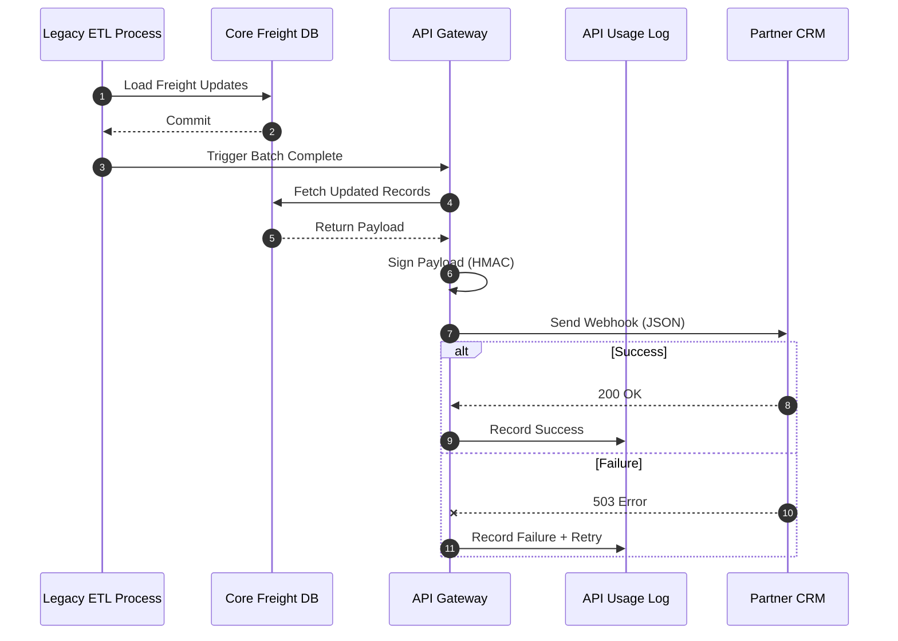

# Scenario 01: High-Throughput API Gateway for Real-Time Alerts

---

## 1. Design Intent

This architecture transforms a legacy, pull-based tracking system into a modern, event-driven integration model.

The goal is not just technical modernization, but to:

- Reduce wasted system load from constant polling  
- Improve data synchronization with partners  
- Provide near-real-time alert delivery  
- Enable auditability and SLA defense  
- Prepare the foundation for API monetization  

---

## 2. The Problem Statement

### Current State

A B2B logistics company relies on a legacy SOAP XML backend for shipment tracking.

External retail partners:
- Must manually query a portal  
- Or run scheduled batch jobs  

---

### Business Pain Points

- Data desynchronization between systems  
- Increased support tickets during peak periods  
- Missed SLAs due to delayed updates  
- High compute cost from repeated polling  

---

### Enterprise Constraints

- **Security & Data Sovereignty:** Data may not always be allowed in public cloud  
- **Cost Control:** High-frequency polling is not sustainable  
- **Partner Readiness:** Some partners cannot support webhooks  

---

## 3. Architecture Overview

The solution shifts from:

**Pull Model → Push Model (Webhooks)**

Key principle:

> Send data only when something happens, not when someone asks for it

---

## 4. Technology Stack Strategy

### Primary Stack (Cloud-Native)

- API Gateway (AWS / Kong Cloud)  
- Serverless transformation layer (AWS Lambda)  
- Message Broker (Amazon SQS)  

**Use Case:**  
When public cloud is allowed and cost optimization is required.

---

### Fallback Stack (On-Premises)

- IBM webMethods (COTS integration platform)  
- OR Kong Gateway (self-hosted) + RabbitMQ  

**Use Case:**  
When regulatory constraints prevent cloud usage.

---

## 5. Payload Transformation

### Legacy Input (SOAP XML)

```xml
<soapenv:Envelope xmlns:soapenv="http://schemas.xmlsoap.org/soap/envelope/">
   <soapenv:Body>
      <FreightUpdate>
         <TrackingID>TRK-998822</TrackingID>
         <RetailPartnerCode>RTL-005</RetailPartnerCode>
         <CurrentStatus>DELAYED_CUSTOMS</CurrentStatus>
         <Timestamp>2026-04-24T08:30:00Z</Timestamp>
      </FreightUpdate>
   </soapenv:Body>
</soapenv:Envelope>
```

---

### Target Output (JSON Webhook)

```json
{
  "event_type": "freight.status_updated",
  "tracking_id": "TRK-998822",
  "partner_id": "RTL-005",
  "data": {
    "status": "Delayed - Customs Hold",
    "updated_at": "2026-04-24T08:30:00Z",
    "action_required": true
  },
  "links": {
    "full_report": "https://api.logistics.com/v1/freight/TRK-998822"
  }
}
```

**Note:**  
The `full_report` link follows a HATEOAS pattern, allowing partners to fetch extended data only when needed.

---

## 6. Architecture Trade-Offs

### Data Layer Constraint

**Rejected Option:**  
Change Data Capture (CDC)

- High cost  
- Risk to legacy system stability  

---

**Selected Approach:**  
Smart Batching

- Listen for "ETL Complete" trigger  
- Push data after batch completes  

---

### Edge Case: Massive Payload

**Risk:**  
Batch generates extremely large payload (e.g., 500MB)

---

**Solution: Claim Check Pattern**

- Replace payload with secure download link  
- Prevents partner system overload  

---

## 7. System Flow



---

## 8. Security & Governance

### HMAC Signing

- Ensures payload integrity  
- Prevents tampering and spoofing  

---

### Rate Limiting

- Protects system from abuse  
- Prevents infinite loops from partner systems  

---

## 9. Observability & Telemetry

The system logs:

- Request timestamps  
- Partner ID  
- HTTP status codes  
- Payload metadata  

---

### Why This Matters

- Enables SLA dispute resolution  
- Provides cost-to-serve analytics  
- Supports operational monitoring  

---

## 10. Fault Tolerance

### Retry Strategy

- Exponential backoff for failed deliveries  

---

### Dead Letter Queue (DLQ)

- After 3 failed attempts  
- Payload routed to DLQ  
- Alert sent to support team  

---

## 11. Testing Strategy

- XML → JSON transformation validation  
- HMAC signature verification  
- Load testing (high-volume scenarios)  
- Partner integration testing  

---

## 12. MVP Scope

- Single Tier-1 partner  
- Daily alert delivery only  
- No developer portal  
- No advanced fallback automation  

---

## 13. Delivery Plan

| Sprint | Focus |
|------|------|
| Sprint 1 | Infrastructure setup + API Gateway |
| Sprint 2 | Transformation + security (HMAC) |
| Sprint 3 | Integration testing + pilot rollout |

---

## 14. Summary

This architecture is not designed for perfection.

It is designed for:

- controlled modernization  
- low-risk execution  
- partner adoption flexibility  
- strong observability  

The system evolves from a rigid legacy model into a flexible, event-driven integration platform.
