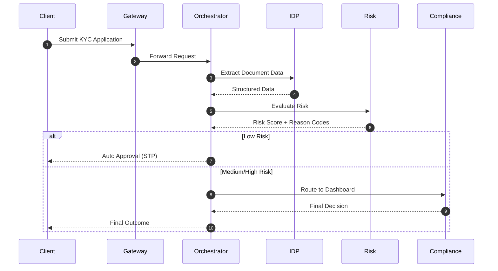

# Scenario 03: Technical Blueprint — Deterministic KYC Orchestration Layer

---

## 1. Design Intent

This architecture modernizes KYC onboarding without replacing core systems or introducing non-deterministic decisioning.

The design separates:

- document processing  
- identity verification  
- risk scoring  
- compliance decisioning  

> **Key Principle**
> AI may assist, but final KYC decisions must remain deterministic, explainable, and auditable.

---

## 2. High-Level Architecture

```text
Client (Mobile / Web)
        ↓
API Gateway
        ↓
KYC Orchestration Layer
        ↓
--------------------------------------------------
| Document Processing (IDP)                      |
| Identity Verification (Legacy / External)     |
| Risk Scoring (Real-Time Risk API)             |
| Compliance Dashboard (Manual Review)          |
--------------------------------------------------
        ↓
KYC State Database
```

---

## 3. Core Architecture Components

### 1. API Gateway

- Handles client requests
- Enforces authentication and rate limiting
- Routes traffic to orchestration layer

---

### 2. KYC Orchestration Layer

Acts as the central controller.

Responsibilities:
- manage workflow state  
- coordinate system calls  
- enforce deterministic rules  
- route decisions  

---

### 3. Intelligent Document Processing (IDP)

Used only for:
- document parsing  
- field extraction  

> **Important**
> IDP does NOT make approval or rejection decisions.

---

### 4. Identity Verification Services

- internal systems  
- third-party providers  

Used to:
- validate identity data  
- cross-check records  

---

### 5. Real-Time Risk API

- replaces batch risk scoring  
- evaluates rules instantly  

Output:
```json
{
  "risk_score": 0.12,
  "risk_level": "LOW",
  "reason_codes": ["VALID_ID", "LOW_RISK_REGION"]
}
```

---

### 6. Compliance Dashboard (Single Pane of Glass)

Used by:
- compliance officers  

Provides:
- full application view  
- extracted data  
- risk results  
- decision controls  

---

### 7. KYC State Database

Stores:

- request status  
- extracted data  
- decision outcomes  
- audit logs  

---

## 4. End-to-End Flow



---

## 5. State Model

| State | Description |
|------|-------------|
| `RECEIVED` | Application submitted |
| `PROCESSING` | IDP and verification running |
| `RISK_EVALUATED` | Risk score available |
| `AUTO_APPROVED` | STP completed |
| `MANUAL_REVIEW` | Routed to compliance |
| `COMPLETED` | Final decision made |
| `FAILED` | Processing error occurred |

---

## 6. Deterministic Decision Logic

Decisioning follows explicit rules:

```text
IF risk_score < threshold AND validation_passed
→ AUTO APPROVE

ELSE
→ ROUTE TO MANUAL REVIEW
```

---

> **Key Insight**
> All decisions must be reproducible and explainable with reason codes.

---

## 7. Data Validation Layer

Validation rules include:

- required fields present  
- format checks  
- identity consistency  
- duplicate detection  

---

### Failure Handling

If validation fails:

- request is flagged  
- routed to manual review  
- audit log is updated  

---

## 8. API Contracts

### Submit Application

`POST /api/v1/kyc/submit`

```json
{
  "customer_id": "12345",
  "documents": ["passport.pdf"],
  "metadata": {
    "channel": "mobile"
  }
}
```

---

### Get Status

`GET /api/v1/kyc/status/{id}`

```json
{
  "status": "MANUAL_REVIEW",
  "risk_level": "MEDIUM"
}
```

---

### Final Result

```json
{
  "status": "COMPLETED",
  "decision": "APPROVED",
  "reason_codes": ["VALID_ID", "LOW_RISK_REGION"]
}
```

---

## 9. Resilience & Fault Handling

### Retry Logic

- IDP failures retried automatically  
- external service failures retried with backoff  

---

### Fallback

If system fails:
- route to manual review  
- notify operations team  

---

### Orphan Detection

- jobs stuck > threshold are flagged  
- moved to `FAILED`  

---

## 10. Security & Compliance

- PII stored in controlled environment  
- encryption at rest and in transit  
- strict access controls  
- full audit logging  

---

## 11. Observability

System tracks:

- processing time  
- decision distribution  
- error rates  
- manual review percentage  

---

## 12. Testing Strategy

- IDP accuracy testing  
- risk rule validation  
- API load testing  
- fallback scenario testing  
- shadow mode comparison  

---

## 13. MVP Scope

### Included

- document extraction  
- risk scoring  
- manual review flow  
- audit logging  

---

### Excluded

- AI decision automation  
- multi-country compliance rules  
- advanced fraud analytics  

---

## 14. Summary

This architecture creates a controlled, scalable KYC process.

It:

- improves onboarding speed  
- maintains regulatory compliance  
- enables gradual modernization  
- avoids high-risk transformation  

> **Final Principle**
> Stability and explainability take priority over full automation in Phase 1.
