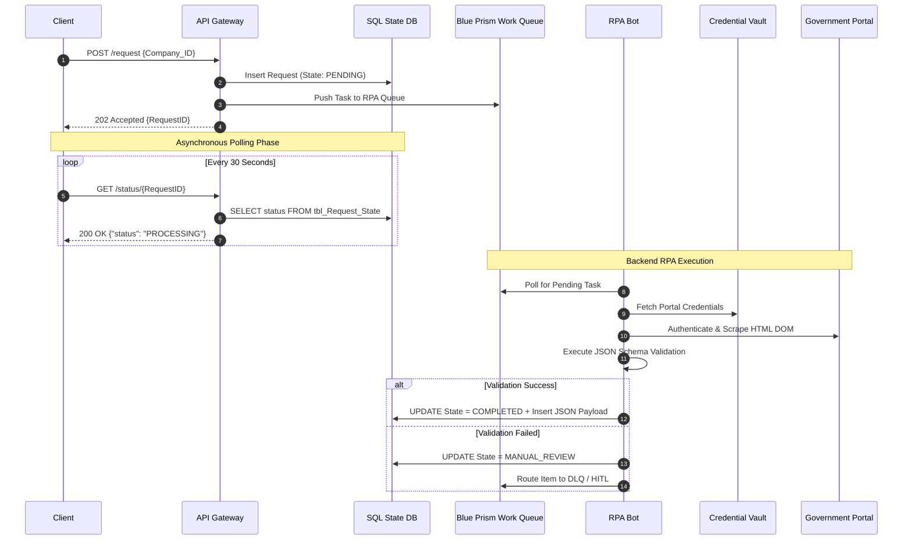

# Scenario 02: Technical Blueprint — Asynchronous RPA API Bridge

---

## 1. Design Intent

This architecture exposes a slow, UI-only government portal through a modern API without making the API client wait for the full RPA execution cycle.

The design separates:

- API request handling
- RPA bot execution
- request state tracking
- validation
- exception handling

The goal is to make an unstable backend process consumable through a stable API contract.

---

## 2. Architectural Patterns

This solution uses three core enterprise architecture patterns.

### 1. Asynchronous Request-Reply

The API immediately accepts the request and returns a `RequestID`.

The client then polls a status endpoint until the result is ready.

---

### 2. State Management

The API reads and writes request status through a centralized SQL state table.

This prevents client polling from hitting the RPA infrastructure directly.

---

### 3. Idempotency

Duplicate client requests must not trigger duplicate bot executions.

The system should cache the initial request and return the existing `RequestID` when the same request is submitted again within the allowed window.

---

## 3. High-Level Flow

```text
Client
→ API Gateway
→ SQL State DB
→ Blue Prism Work Queue
→ RPA Bot
→ Government Portal
→ JSON Validation
→ SQL State DB
→ Client polls result
```

---

## 4. Sequence Diagram



---

## 5. State Model

| State | Description |
|------|-------------|
| `PENDING` | Request accepted and waiting for bot execution |
| `PROCESSING` | Bot has picked up the task |
| `COMPLETED` | Data was scraped, validated, and stored successfully |
| `MANUAL_REVIEW` | Automation failed and human review is required |
| `FAILED` | Request exceeded timeout or unrecoverable failure occurred |

---

## 6. Data Quality & Validation Engine

To prevent **Garbage In, Garbage Out**, the RPA bot validates scraped data before writing the result to the database.

### Validation Rules

Examples:

- `registration_number` must match the expected numeric length
- `company_name` must not be empty
- `status` must match allowed values
- `issue_date` must follow valid date format
- `capital_amount` must be numeric

---

### Failure Behavior

If validation fails:

1. Database write is aborted using `ROLLBACK`
2. Request state is updated to `MANUAL_REVIEW`
3. Task is routed to DLQ / HITL
4. Support team reviews the case manually

---

## 7. API Contract Specifications

### Service A: Initiator

`POST /api/v1/registry/request`

Creates a new registry lookup request.

#### Success Response

**HTTP Status:** `202 Accepted`

```json
{
  "request_id": "REQ-998877",
  "status": "PENDING",
  "status_url": "/api/v1/registry/status/REQ-998877"
}
```

---

### Service B: Poller

`GET /api/v1/registry/status/{RequestID}`

Returns the current status of the request from `tbl_Request_State`.

---

#### State 1: Running

**HTTP Status:** `200 OK`

```json
{
  "request_id": "REQ-998877",
  "status": "PROCESSING"
}
```

---

#### State 2: Manual Review

**HTTP Status:** `200 OK`

```json
{
  "request_id": "REQ-998877",
  "status": "MANUAL_REVIEW",
  "message": "Routed to operations.",
  "estimated_completion": "24_HOURS"
}
```

---

#### State 3: Completed

**HTTP Status:** `200 OK`

```json
{
  "request_id": "REQ-998877",
  "status": "COMPLETED",
  "timestamp": "2026-04-25T19:13:15Z",
  "data": {
    "company_name": "Tech Solutions LLC",
    "registration_number": "1010123456",
    "status": "ACTIVE",
    "issue_date": "2015-08-12",
    "capital_amount": 500000
  }
}
```

---

### Service C: Audit Trail

`GET /api/v1/registry/history?company_id={ID}`

Returns historical API calls using pagination.

#### Example Response

```json
{
  "company_id": "1010123456",
  "page": 1,
  "limit": 50,
  "records": [
    {
      "request_id": "REQ-998877",
      "status": "COMPLETED",
      "timestamp": "2026-04-25T19:13:15Z"
    }
  ]
}
```

---

## 8. Resilience & Error Handling

### API Rate Limiting

The gateway enforces client-specific quotas.

If a client exceeds the limit, the system returns HTTP `429`.

```http
HTTP/1.1 429 Too Many Requests
Retry-After: 3600
Content-Type: application/json

{
  "error_code": "RATE_LIMIT_EXCEEDED",
  "message": "Quota exceeded. Please wait 3600 seconds."
}
```

---

### Exponential Backoff

If the bot cannot connect to the SQL database, it retries the transaction using increasing delays.

Example:

```text
5 seconds → 15 seconds → 30 seconds
```

---

### Orphan Sweep

An automated SQL Agent Job runs every 10 minutes.

It locates any `RequestID` stuck in `PROCESSING` for more than 2 hours and moves it to `FAILED`.

This prevents infinite client polling loops.

---

## 9. Security Controls

### Credential Vault

Bot credentials must not be stored inside the RPA script.

The bot retrieves credentials from:

- CyberArk
- Azure Key Vault
- or equivalent enterprise credential vault

---

### SQL Access Control

Only approved service accounts should write to `tbl_Request_State`.

Human operators should use an internal admin portal instead of direct SQL access.

---

### Audit Logging

The system must log:

- Request creation
- Bot pickup time
- Portal access result
- Validation result
- Final state update
- Manual review events

---

## 10. Operational Support Model

### Human-in-the-Loop

If automation fails, the task is routed to a human operator.

The operator can:

- Review failed extraction
- Manually search the government portal
- Validate the result
- Submit the final data through the admin portal

---

### Dead Letter Queue

The DLQ stores failed tasks that require review.

Common causes:

- Portal layout changed
- Captcha appeared
- Credentials failed
- Network timeout occurred
- Validation failed

---

## 11. Testing Strategy

Testing must validate both API behavior and RPA behavior.

### Required Test Areas

- API request creation
- Status polling
- Duplicate request handling
- Bot queue pickup
- Credential vault access
- Portal login flow
- HTML scraping accuracy
- JSON schema validation
- SQL transaction rollback
- DLQ routing
- HITL manual completion
- Rate limiting behavior
- Orphan sweep behavior

---

## 12. MVP Scope

### Included

- Request initiation API
- Status polling API
- SQL state table
- Blue Prism queue integration
- Bot execution for one portal flow
- JSON validation
- DLQ / HITL fallback
- Basic audit trail

---

### Excluded

- Multi-portal support
- Self-service partner onboarding
- Advanced analytics dashboard
- Fully automated remediation
- Direct government API integration

---

## 13. Summary

This architecture provides a stable API boundary around an unstable backend process.

It does not pretend that RPA is ideal.

Instead, it uses:

- asynchronous API design
- state management
- queues
- validation
- retry logic
- human fallback

to make a fragile UI automation process safe enough for controlled enterprise use.
